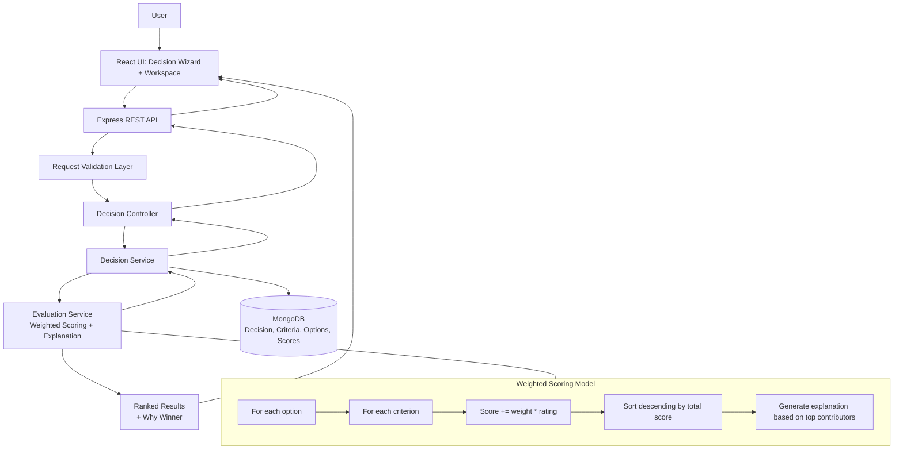

# Decision Companion System — Decision Logic & Architecture Diagram

## Notes

- The recommendation is deterministic and explainable.
- AI is optional and non-critical; core ranking does not depend on AI calls.
